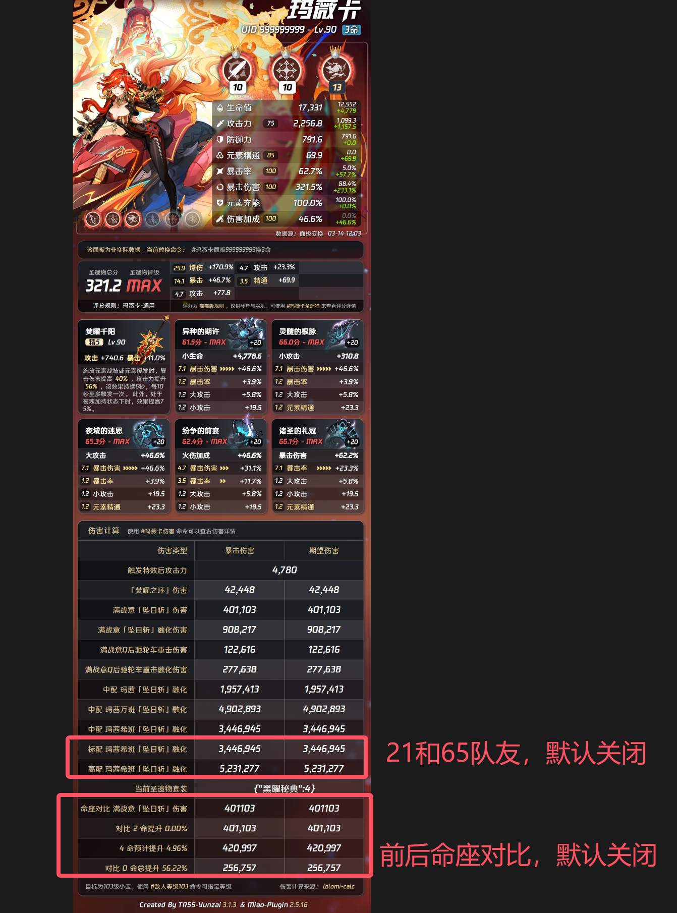

  
  <h2 style="margin: 0;">Miku Miku Beeeeeeeeam</h2>

# Yunzai目录下安装
git clone --depth=1 https://gitee.com/land-route_lu/lolomi-calc.git ./plugins/lolomi-calc/

# 声明
复用liangshi-calc基础框架模版，组队和计算逻辑已重构
* 梁氏源地址 https://gitee.com/liangshi233/liangshi-calc/tree/master
* 计算只适配了梁氏和喵喵，原神角色计算优先级会高于梁氏和喵喵
* 会提前更新下版本的角色计算，要提前用的话需要自己在miao-plugin里更新对应数据，一般只以V1测试数据写伤害计算，正式服上线后再做对应调整
# 相关依赖
建议用 TRSS-Yunzai
* TRSS-Yunzai   https://github.com/TimeRainStarSky/Yunzai
* Miao-Yunzai   https://github.com/yoimiya-kokomi/Miao-Yunzai
* miao-plugin   https://github.com/yoimiya-kokomi/miao-plugin
# 插件说明
* 操作指令说明  #洛洛米帮助
* 移除其他不必要功能，仅保留原神角色伤害计算和极限/核爆/辅助面板
* 一般按最新角色和当前卡池五星角色更新，有需要先加的角色可提，已写角色可查看 character.md 文件
* 精力有限，老角色更新会很慢，每个角色定义好适配的词条计算会在千星木桩里测试准确性，尤其是一轮循环的总伤，一般一个角色都会耗时1天左右，某些复杂的技能模组会更麻烦，所以老角色随缘更新
* 首次安装默认开启 lolomi-calc，默认关闭预设2+1标配队友，默认关闭前后命座提升对比
* 伤害计算优先级：存在已写好的角色数据默认使用 lolomi-calc 计算，如果不存在则使用梁氏>喵喵
* 增加组队配队伤害，根据面板主角色命座配置对应的预设队友，标配计算开关的作用就是不管你主角色几命都会额外再返回 2+1 和 6+5的队友配置伤害
* 主角色 6 命默认配置 6+5 队友，2-5 命默认配置 2+1 队友，2 命以下配置 0+0 队友
* 队伍伤害计算一般都不考虑buff覆盖率和生效次数，高配情况下存在几十万的队伍伤害差异属于正常现象

<b>效果图预览</b>

  

<b>已写角色</b>

- 七七
- 丽莎
- 八重神子
- 兹白
- 初音未来
- 刻晴
- 哥伦比娅
- 夜兰
- 宵宫
- 枫原万叶
- 法尔伽
- 温迪
- 玛拉妮
- 玛薇卡
- 珊瑚宫心海
- 琴
- 甘雨
- 申鹤
- 神里绫人
- 神里绫华
- 胡桃
- 芭芭拉
- 茜特菈莉
- 莉奈娅
- 莫娜
- 达达利亚
- 钟离
- 雷电将军
- 魈
- 菲林斯
- 伊涅芙
- 爱可菲
- 丝柯克
- 尼可
- 洛恩
- 布伦妮
- 恰斯卡
- 奈芙尔
- 菈乌玛
- 桑多涅
- 杜林
- 雅珂达
- 千织
- 希格雯
- 阿蕾奇诺
- 克洛琳德
- 闲云
- 娜维娅
- 爱诺
- 塔利雅
- 伊法
- 瓦蕾莎
- 伊安珊
- 奥黛塔

 